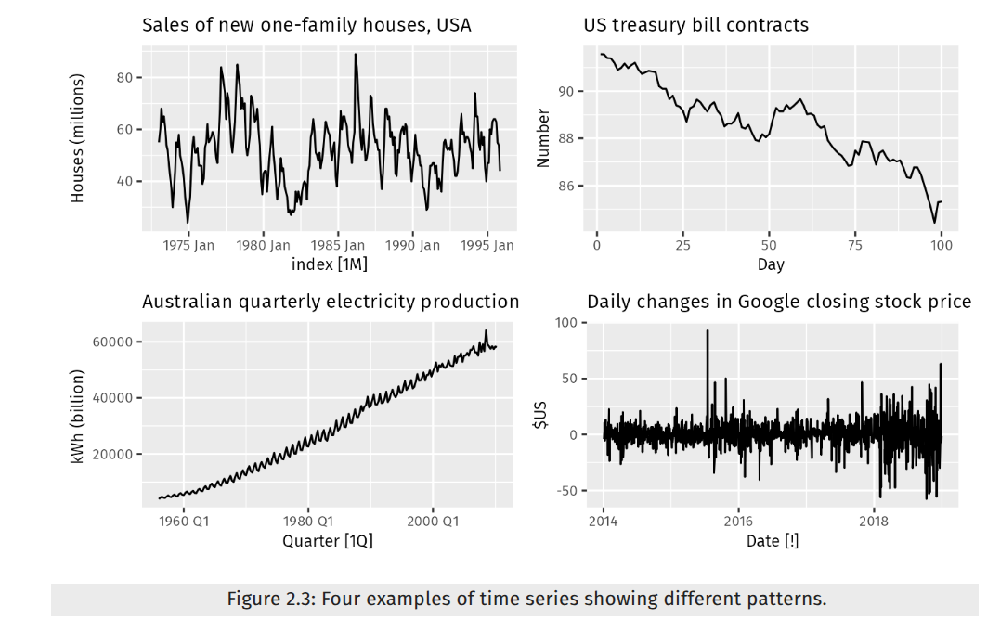

### Content

| <u>**11. Time Series using Tensorflow**</u>  ||
|---------|----------|
| **Concept** | **Notebook** |
|--> Data loading and pre-processing|1|
|--> Alternative to import data using python-csv module |1|
|--> Creating train-test splits for time-series data (wrong-way)|1|
|--> Creating train-test splits for time-series data (right-way)|1|
|--> Creating plotting function to visualize time-series data |1|
|--> Modelling Experiments |2|
|--> Building Naive model (baseline) |2|
|--> Most common time series evaluation metrics |2|
|--> Implementing MASE in code |2|
|--> Creating function to evaluate model's forcast |2|
|--> Other models for time series forcasting|2|
|--> Windowing our dataset|3|
|--> Preprocessing function to window our dataset|3|
|--> Turning windows into training and test sets|3|
|--> Creating a modelling checkpoint callback to save our model|4|
|--> Building Dense model (model 1) (horizon = 1, window = 7)|4|
|--> Building Model 2 (same as model 1) (horizon = 1, window = 30)|5|
|--> Building Model 3 (same as model 1) (horizon = 7, window = 30)|6|
|--> Comparing modelling experiments (baseline,1,2,3)|7|
|--> Preparing data for input to sequence models |8|
|--> Building Model 4 (conv1D) (horizon = 1, window = 7)|8|
|--> Building Model 5 (LSTM) (horizon = 1, window = 7)|9|
|--> Multivariate time series (Model 6)|10|
|--> Making a windowed dataset using Pandas|10|
|--> Replicating N-BEATS algorithm (Model 7)|11|
|--> --> Building and testing the N-BEATS block layer|11|
|--> --> Creating a performant data pipeline using `tf.data` |11|
|--> --> Setting up hyperparameters for N-BEATS (Generic version) with Daily data |11|
|--> --> Setting up residual connections in N-BEATS |11|
|--> --> Building, Compiling and fitting the N-Beats algorithm |11|
|--> --> Saving and loading N-BEATS model |11|
|--> --> Plotting the N-BEATS architecture  |11|
|--> Creating an ensemble (Model 8) |12|
|--> Saving and loading trained ensemble model |12|
|--> Importance of prediction intervals (uncertainity estimates) in forcasting |12|
|--> Types of uncertainity in machine learning |13|
|--> Future Prediction Model (Model 9)|13|
|--> Black Swan Theory - The turkey problem (Model 10) (same as model 1) (horizon = 1, window = 7) |14|
|--> Comparing the models trained so far |15|
 

### Notes (Introduction)
* data has time component (temporal)
* Example time series problems:
  * classification (given a time varying signal) [output: discrete]
    * eg: heart beat monitoring (electro-cardiogram), to check for anamolies?
    * eg: what electronic device is it?
  * Forcasting [output: continuous]
    * The longer you forcast in the future, the higher the chance of an error
    * how much?
    * how many?
    * market demand?
    * compute demands
    * market campaigns
    * other forcasting problems:
      * weather
      * food quantity we need
      * estimating how long something's gonna take
* What can we forcast?
  * Things which have the most impact in our lives are usually unplanned and un-predictable
  * Although we can build a model to make predictions, but it is not necessary for every prediction one makes to be true
  * https://otexts.com/fpp3/
  * https://arxiv.org/pdf/1905.10437 | N-BEATS: NEURAL BASIS EXPANSION ANALYSIS FOR
INTERPRETABLE TIME SERIES FORECASTING
* We can have black swan events in time-series prediction/forcasting
* Inputs and Outputs of our forcasting problem:
  * output: continuous
  * input: time-series data is already numerical
* for bit-predict problem:
  * input shape: [batch_size,window_size]
  * output shape: [horizon]
  * window is the amount of data we put into a model for a time series
  * windows are changeable
  * horizon is the time for which the output is predicted for
  * It is a sequence problem (seq2seq)
    * many to one (predicting next day based on previous week's data)
    * many to many (predicting next week based on previous month's data)
* Different kinds of time-series patterns
  
  </img>
  * `Trend`: A trend exists when there is a long-term increase or decrease in the data. It does not have to be linear. Sometimes we will refer to a trend as “changing direction”, when it might go from an increasing trend to a decreasing trend.There is a trend in the antidiabetic drug sales data shown in Figure 2.2.
  * `Seasonal`: A seasonal pattern occurs when a time series is affected by seasonal factors such as the time of the year or the day of the week. Seasonality is always of a fixed and known period. The monthly sales of antidiabetic drugs (Figure 2.2) shows seasonality which is induced partly by the change in the cost of the drugs at the end of the calendar year. (Note that one series can have more than one seasonal pattern.)
  * `Cyclic`: A cycle occurs when the data exhibit rises and falls that are not of a fixed frequency. These fluctuations are usually due to economic conditions, and are often related to the “business cycle”. The duration of these fluctuations is usually at least 2 years.
  
* Univariate and Multi-variate time-series data
  * Univariate: one-variable (eg: using price of bitcoin predict price of bitcoin)
  * Multi-variate: more than one variable (eg: using price of bitcoin + block reward size to predict price of bitcoin)

    
